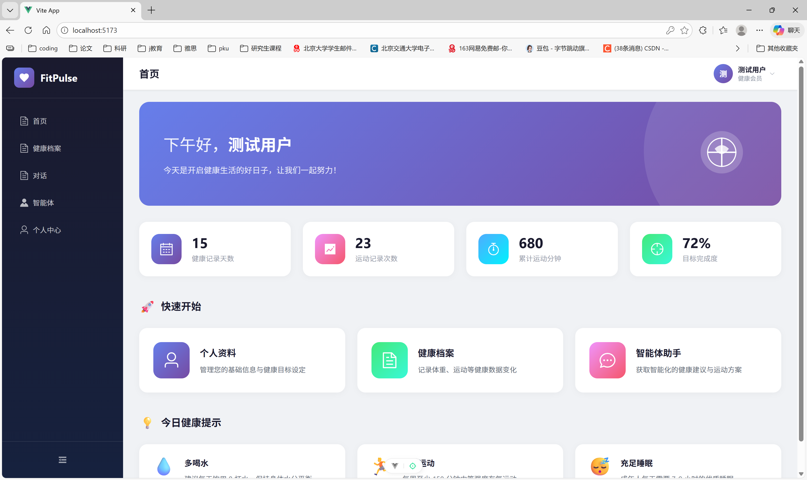
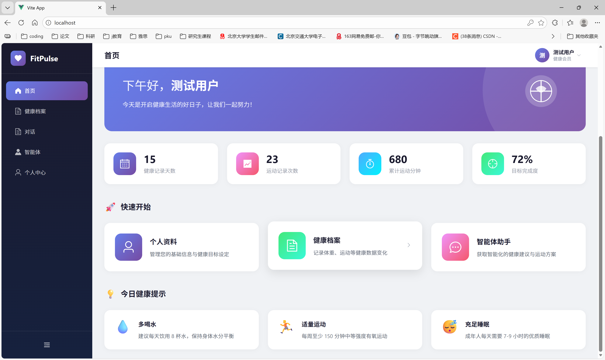
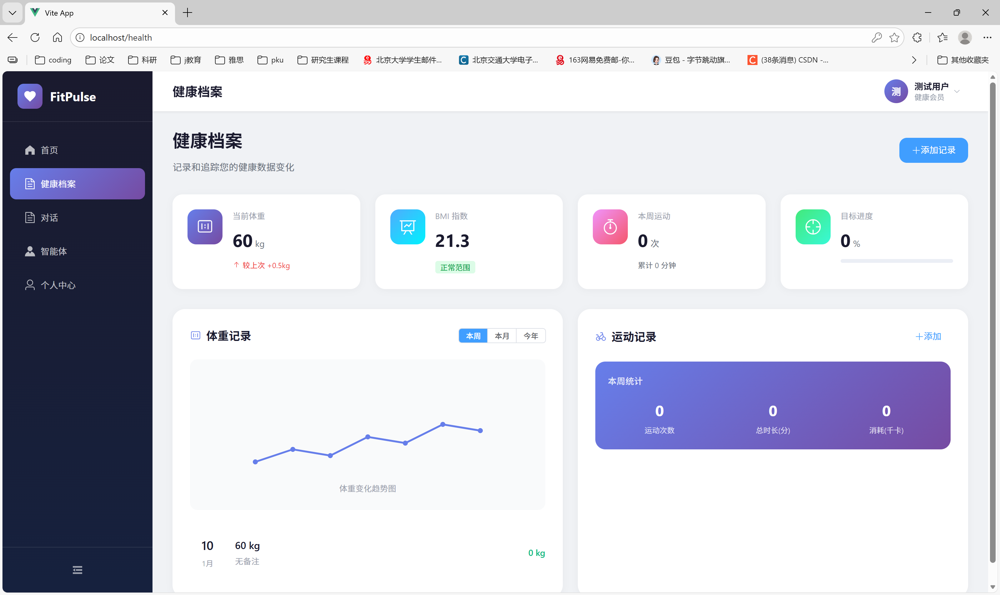
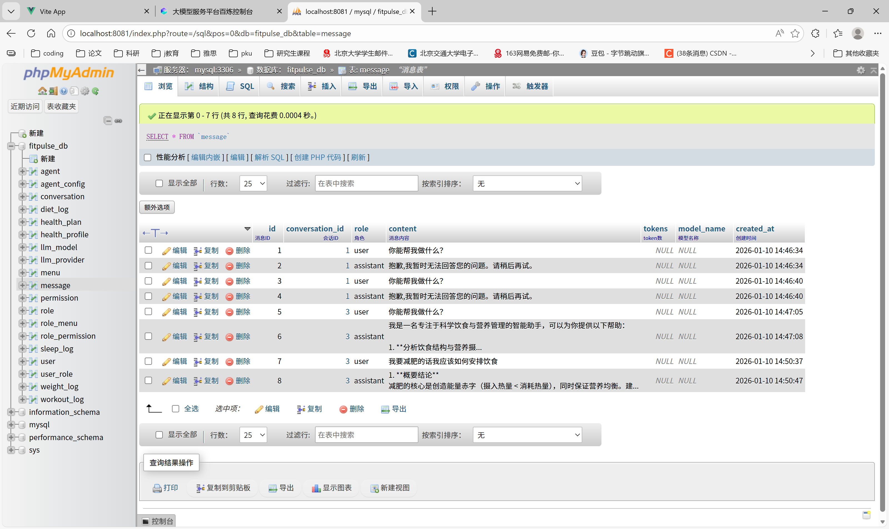
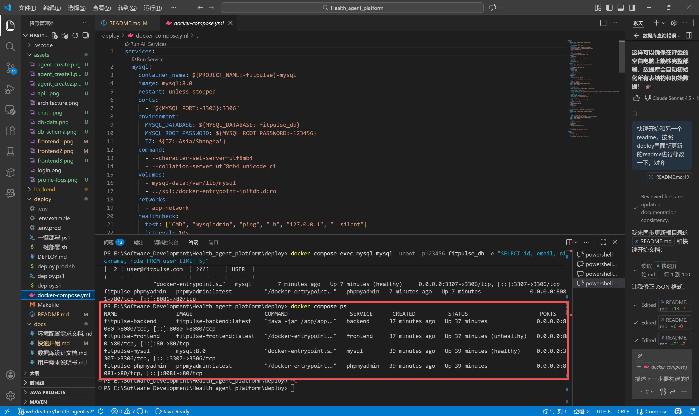

# FitPulse 智能健康助手（Health Agent Platform）项目说明文档
## 一、项目简介
FitPulse 是一个可部署的全栈智能健康助手项目，集成了前端管理端、后端服务、数据库初始化与容器化部署能力，支持通过 LLM API 实现智能问答/健康建议等能力。项目采用 Docker + Docker Compose 进行一键部署，覆盖从数据库建模、后端接口到前端界面与反向代理的完整工程链路。

> 本仓库用于课程个人期末作业提交：智能体应用开发（全栈 + 数据库 + Docker 容器化 + LLM API 调用）。

---

## 二、项目功能介绍
本项目面向健康管理场景，提供用户认证、角色权限、健康档案、体重/训练/睡眠/饮食等基础数据记录，以及基于智能体的对话与健康建议。后端暴露 RESTful API，前端提供表单录入与数据列表、图表展示，支持按用户维度的健康信息汇总。智能体会读取健康档案与历史记录，返回结合目标（减脂/增肌/维持）与慢病风险的建议；会话模块持久化对话历史，便于再次进入时延续上下文。数据库初始化脚本可一键建库、建表并写入基础数据；容器化编排让 MySQL、后端、前端、phpMyAdmin 可同时启动，降低同学在本地搭建环境的成本。


### 功能概览：
- **一键部署与可复现**：`docker compose up -d --build` 即可完成全栈启动
- **全栈容器化编排**：MySQL / PHPMyAdmin / Spring Boot 后端 / Vue 前端统一编排与联动启动
- **数据库自动初始化**：首次启动自动执行 `sql/01_schema.sql` 与 `sql/02_init_data.sql`
- **前后端联调与反向代理**：Nginx 统一入口，`/api/` 代理至后端服务
- **后端配置环境变量化**：支持 `dev/prod` profile 与 `.env` 注入（端口、DB、LLM Key 等）
- **LLM API 接入**：通过环境变量配置 OpenAI / DashScope Key（按项目实现调用）

---

## 三、功能实现状态

✅ 已实现
- Docker Compose 一键部署（MySQL / phpMyAdmin / Spring Boot 后端 / Vue 前端-Nginx）
- 数据库初始化（sql/00_init.sql、sql/01_schema.sql、sql/02_init_data.sql）
- 用户注册 / 登录鉴权（基于 JWT，后端前缀 `/api`，认证接口位于 `/api/v1/auth/*`）
- RBAC 角色权限模型（管理员 / 普通用户、菜单 + 权限点，按 02_init_data.sql 初始化）
- 健康档案与基础记录管理（体重 / 训练 / 睡眠 / 饮食等，前端有对应页面，后端有对应接口）
- 智能对话：后端调用 LLM API（OpenAI / DashScope 等）返回健康建议
- 会话历史持久化：会话 & 消息记录落库，可再次进入查看历史


## 三、项目实现截图
### 1）前端首页 / 管理端




### 2）智能对话 / LLM 能力展示


### 3）健康档案 / 数据记录（体重/训练/睡眠/饮食）



### 4）数据库表结构（部分）


### 5）数据落库示例（会话/消息/健康档案）



### 6）容器运行状态（docker compose ps）



---


## 四、技术栈与架构

**前端**
- Vue 3 + Vite
- Nginx 静态托管 + API 反向代理（`/api/`）

**后端**
- Java / Spring Boot（支持 `dev/prod` profile）
- MyBatis-Plus
- JWT（用于鉴权/会话，按项目实现）
- LLM API：OpenAI / DashScope（按环境变量配置）

**数据库与运维**
- MySQL 8.0（UTF8MB4，数据持久化 volume）
- PHPMyAdmin（数据库管理界面）
- Docker 多阶段构建（后端/前端）
- Docker Compose 服务编排与健康检查


---

## 五、项目目录结构
```bash
HEALTH_AGENT_PLATFORM/
├── backend/ # Spring Boot 后端代码
│ ├── Dockerfile
│ └── src/main/resources/
│ ├── application.yml
│ ├── application-dev.yml
│ └── application-prod.yml
├── frontend/ # Vue3 + Vite 前端代码（Nginx 部署）
│ ├── Dockerfile
│ ├── nginx.conf
│ └── ...
├── sql/ # 数据库初始化脚本（首次启动自动执行）
│ ├── 01_schema.sql
│ └── 02_init_data.sql
├── deploy/ # 部署中心：脚本、配置模板、详细部署说明
│ ├── deploy.sh
│ ├── deploy.ps1
│ ├── docker-compose.yml # （历史/备份：根目录 compose 为主入口）
│ ├── .env.example
│ └── README.md
├── docs/ # 设计与文档 
├── docker-compose.yml # ✅ 根目录服务编排（主入口）
├── .gitignore
└── README.md # ✅ 项目说明文档（本文件）
```

---

## 六、环境要求

- Docker Desktop（Windows/macOS）或 Docker Engine（Linux）
- Docker Compose v2（通常随 Docker 自带）
- 端口（默认，可通过 `.env` 修改）：
  - 前端：`80`
  - 后端：`8080`
  - PHPMyAdmin：`8081`
  - MySQL：`3307`（映射到容器 3306，避免本机冲突）

---

## 七、快速开始（Docker Compose 一键部署）

### 7.1 配置环境变量（必须）

本项目使用根目录 `.env` 作为环境变量入口（**不提交到 Git**）。

1）创建 `.env`（从模板复制）：

```bash
cp deploy/.env.example .env
```
2）编辑 `.env`，至少配置 LLM Key（按需选择）：

OpenAI：`OPENAI_API_KEY=...`

DashScope：`DASHSCOPE_API_KEY=...`（可选）

提示：若不配置 LLM Key，与 LLM 相关功能可能无法调用（具体取决于你的后端实现）。建议评测/演示前配置好 Key。

### 7.2 构建并启动服务

在仓库根目录执行：
```bash
docker compose up -d --build
```
启动后查看容器状态

```bash
docker compose ps
```
### 7.3 访问地址

前端应用：http://localhost

后端 API：http://localhost:8080/api

PHPMyAdmin：http://localhost:8081

MySQL：127.0.0.1:3307（账号密码以 .env 为准；默认示例通常为 root/123456）

---

## 八、快速演示（3–5 分钟）

1）启动服务

```bash
cp deploy/.env.example .env

docker compose up -d --build
docker compose ps
```

2）访问页面

- 前端：http://localhost
- 后端 API 前缀：http://localhost:8080/api
- phpMyAdmin：http://localhost:8081

3）演示流程（建议顺序）

- 使用下方演示账号登录（或自行注册）
- 进入“健康档案 / 健康记录”相关页面，填写或更新体重 / 训练 / 睡眠 / 饮食等记录
- 打开“智能对话 / Chat”页面，提问（如：“根据我的目标给出一周训练和饮食建议”）
- 重新进入或刷新对话页面：确认历史对话仍然存在（验证会话 & 消息持久化）

> 只要按上面步骤走一遍，即可在 3–5 分钟内完整展示“登录 → 填写健康数据 → AI 对话 → 历史对话持久化”这一完整闭环。

## 八、常用运维命令
```bash
# 查看日志（所有服务）
docker compose logs -f

# 只看后端日志
docker compose logs -f backend

# 停止服务（保留数据卷）
docker compose down

# 停止并删除数据卷（会清空 MySQL 数据）
docker compose down -v
```

---

## 九、演示账号与角色说明

初始化数据位于 `sql/02_init_data.sql`，其中包含基础角色（管理员 / 普通用户）、权限点和菜单。具体账号以 SQL 文件为准，如果你在本地修改了初始化脚本，请以自己修改后的为主。

示例说明（请按实际 SQL 为准，可在 02_init_data.sql 中查阅）：

- 管理员（Admin）：例如 `admin@example.com` / `Admin123!`
- 普通用户（User）：例如 `user@example.com` / `User123!`

> 若仓库未内置具体账号或你已删除初始用户，请在前端“注册 / 登录”页面自行注册账号，再使用新账号登录系统进行演示。

## 九、数据库初始化说明

`sql/` 目录包含初始化脚本：

`01_schema.sql`：创建表结构

`02_init_data.sql`：插入初始数据（如有）

首次启动 MySQL 容器时会自动执行初始化脚本；若已存在持久化数据卷，则不会重复执行。

如需“重置数据库并重新初始化”，请执行：
```bash
docker compose down -v
docker compose up -d --build
```

---

## 十、一键部署脚本（可选）

为方便不同系统快速部署，deploy/ 目录提供脚本封装（环境检查、端口检测、构建、启动、健康检查等）：

Linux / macOS
```bash
bash deploy/deploy.sh deploy
```
Windows PowerShell
``` bash
Set-ExecutionPolicy -Scope Process RemoteSigned
.\deploy\deploy.ps1 deploy
```

更详细说明请查看：deploy/README.md

---

## 十一、LLM API 配置说明

LLM 调用通过环境变量配置（以 .`env` / `.env.example` 为准）：

`OPENAI_API_KEY`：OpenAI Key（如启用 OpenAI 调用）

`DASHSCOPE_API_KEY`：DashScope Key（如启用通义/百炼等能力）

其他模型相关配置：可在后端 `application*.yml` 中查看（如 `base_url`、`model` 等）

---

## 十二、环境变量说明（.env）

本项目使用根目录 `.env` 作为统一环境变量入口，deploy/.env.example 给出了完整示例。常用/关键项如下（具体以示例文件为准）：

- 数据库相关
  - `MYSQL_HOST` / `MYSQL_PORT` / `MYSQL_DATABASE` / `MYSQL_USER` / `MYSQL_PASSWORD` / `MYSQL_ROOT_PASSWORD`
- 端口相关
  - `FRONTEND_PORT`（前端对外端口，默认 80）
  - `BACKEND_PORT`（后端对外端口，默认 8080）
  - `PMA_PORT`（phpMyAdmin 对外端口，默认 8081）
  - `MYSQL_EXPOSE_PORT`（宿主机映射的 MySQL 端口，默认 3307）
- 鉴权相关
  - `JWT_SECRET`（JWT 签名密钥，不配置则使用 application.yml 中的默认值，生产环境建议必须覆盖）
- LLM 相关
  - `OPENAI_API_KEY`（可选但强烈建议在演示时配置）
  - `DASHSCOPE_API_KEY`（如使用通义千问 / 百炼等国内模型）

> 建议实际部署时至少确认：数据库、端口映射、JWT_SECRET 和 LLM Key 四类变量均已正确设置。

---

## 十三、LLM Key 未配置时的行为

- 未配置 `OPENAI_API_KEY` 或对应提供商 Key 时：后端调用 LLM 接口会返回“未配置 Key / 无法调用”或相应错误提示（具体文案以后端实现为准）。
- 其他业务功能（登录 / 鉴权、健康档案与记录管理、页面浏览、数据库持久化等）**不受影响，可以正常演示**。

> 也就是说：即便评测环境没有任何外网 Key，老师依然可以完整体验“登录 + 健康数据管理 + 对话页面 UI & 错误提示 + 历史对话列表”等功能，不会导致整个系统“看起来坏掉”。

---

## 十四、接口说明（关键 API）

- 统一前缀：所有后端接口默认通过 Nginx 以 `/api` 作为前缀对外暴露（对应 Spring Boot `server.servlet.context-path=/api`）。

认证 / 用户相关
- POST `/api/v1/auth/register` 用户注册
- POST `/api/v1/auth/login` 用户登录，返回 JWT Token
- GET `/api/v1/auth/me` 获取当前登录用户信息

健康档案 / 记录相关（示例，具体以后端 controller 实现为准）
- 示例：`/api/health/profile` 获取 / 更新个人健康档案
- 示例：`/api/weight/*`、`/api/workout/*`、`/api/sleep/*`、`/api/diet/*` 等用于体重 / 训练 / 睡眠 / 饮食记录的查询与写入

智能体与对话相关
- GET/POST `/api/agents` 智能体列表 / 创建智能体
- GET `/api/agents/{id}` 智能体详情
- POST `/api/chat` 与智能体对话（简化接口，自动创建会话）
- POST `/api/message/send` 发送消息，与指定会话 / 智能体对话
- GET `/api/conversation/list` 会话列表
- GET `/api/conversation/{id}` 会话详情
- GET `/api/message/history` 会话消息历史

> 如果你在项目中启用了 Swagger / Knife4j 等接口文档，可以在此补充实际访问地址（例如：`http://localhost:8080/api/doc.html` 或 `http://localhost:8080/swagger-ui.html`）。目前以手写关键 API 说明为主，方便老师快速对照代码理解项目结构。

---

## 十五、常见问题（Troubleshooting）
### 12.1 端口冲突

若 `80/8080/8081/3307` 被占用，请修改 `.env` 中端口后重启：
```bash
docker compose down
docker compose up -d --build
```
### 12.2 前端能打开但接口 404 / 502

检查后端是否正常启动、Nginx 是否成功代理 `/api/`：
``` bash
docker compose ps
docker compose logs -f backend
docker compose logs -f frontend
```
### 12.3 Windows 脚本无法执行

PowerShell 执行：
```bash
Set-ExecutionPolicy -Scope Process RemoteSigned
```
